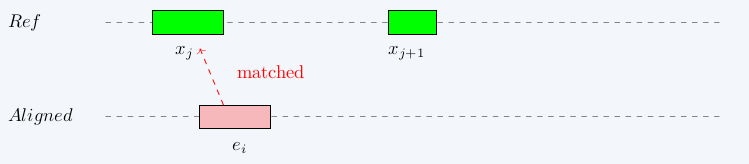
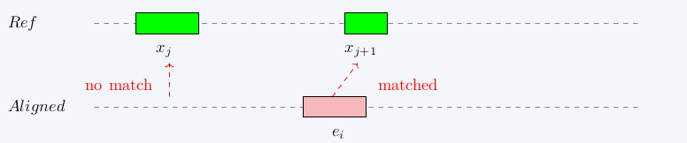
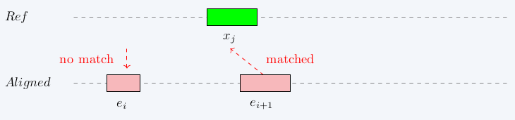
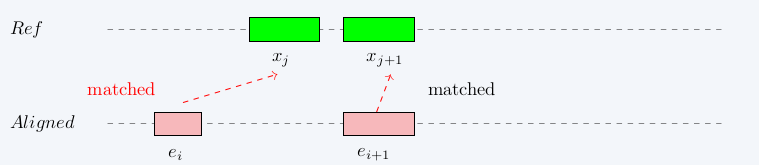
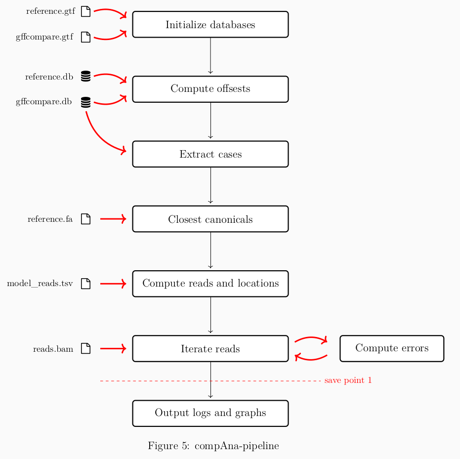
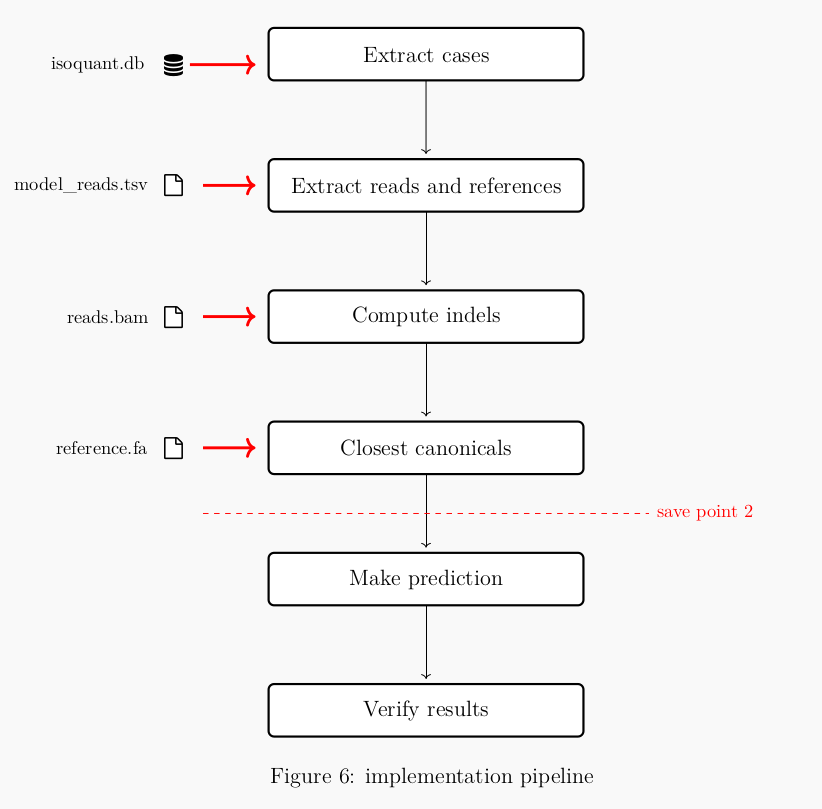

# General information
[Back to README.md](../README.md)  

**Content:**  

- [Analyzing errors](#analyzing-errors)
  - [Offsets](#offsets)
    - [Defining offset](#defining-offset)
    - [Computing offset](#computing-offset)
    - [Pseudocode](#pseudocode)
    - [Offset output](#offset-output)
  - [Extracting information](#extracting-information)
    - [Extracting closest canonicals](#extracting-closest-canonicals)
    - [Processing imported BAM-file](#processing-the-imported-bam-file)
    - [Processing CIGAR-string](#processing-a-cigar-string)
    - [Extracting CIGAR-codes](#extracting-cigar-codes-from-the-window-next-to-aligned-location)
  - [Data structures](#data-structures)
    - [Normalizing results](#normalizing-results)
  - [Output](#compana-output-files)
  - [Pipeline](#pipeline)
- [Implementing error prediction and correction](#implementing-error-prediction-and-correction)
  - [Pipeline for implementation](#pipeline-for-implementation)
  - [Extracting intron sites and information](#extracting-intron-sites-and-information)
  - [Computing indels](#computing-indels)
  - [Closest canonicals](#closest-canonicals)
  - [Making predictions](#making-predictions)
  - [Verifying predictions](#verifying-predictions)
- [Implementing code to IsoQuant](#implementing-code-to-isoquant)

The purpose of this application is to 

1. study what happens in the locations, where the transcript provided by IsoQuant differs from the reference data
2. introduce a solution that identifies and repairs constrained error cases in transcripts

The application uses the following libraries to process information: [pysam](https://pysam.readthedocs.io/en/latest/), [gffutils](http://daler.github.io/gffutils/) and [pyfaidx](https://github.com/mdshw5/pyfaidx/)

The application expects the user to provide the following files:
1. a GTF-file produced by gffcompare. The gffcompare should be run with the GTF-file produced by IsoQuant and a reference GTF-file. 
2. the reference GTF-file
3. GTF-file produced by IsoQuant
4. reference FASTA-file. 
5. BAM-file containing the reads
6. a TSV-file produced by IsoQuant ending in 'model_reads.tsv'

User should provide additional arguments to define
- the gffcompare class-codes to select transcripts for processing
- the range of offset cases that will be looked into

With optional arguments user can adjust debugging, creating simple additional statistics or to force recreating the sqlite3-databases created by gffutils. For more information see [instruction manual](instruction-manual.md)

# Analyzing errors 

## Offsets

GTF-file `gffcompare` outputs contains class codes for transcripts. These class codes provide information on the quality of the alignment. One interesting aspect in the case of misalignments is the amount of the offset in the misalignment. This section provides a definition for offset and details how offset is calculated in this application. 

### Defining offset  
[Back to top](#general-information)  

Let $S$ be  a transcript from a `transcript_model.gtf` produced by IsoQuant and assume that $S$ has one or more exons as children. Let the set of these exons be $E = \\{e_1, \ldots , e_n\\},\\,n\in\mathbb{N},\\,\mid E\mid \ge 1$. Let $R$ be a transcript from the reference GTF-file to which $S$ is being compared to. Let exon "children" in $R$ be $X = \\{x_1, \ldots, x_m\\}$. 

Each exon are given as a tuple with a start index and an end index $(a, b)\\, a,b\in\mathbb{N},\\,a < b$. Let $e_i\in E$ and $x_j\in X$ be an arbitrary exons and let $e_i = (a_{e_i}, b_{e_j})$ and $x_j = (a_{x_i}, b_{x_j})$.  

**Assumption:** for a selected transcript, the exon children do not overlap. That is, for arbitrary two exons $e_i = (a_{e_i}, b_{e_i}) $ and $e_k = (a_{e_k}, b_{e_k})$ ($e_i, e_k \in E$) it always holds that either $b_{e_i} < a_{e_k}$ or $b_{e_k} < a_{e_i}$

**Definition 1.** For arbitrary $e_i$ and $x_j$ The distance $a_{e_i} - a_{x_j}$ is the offset at the start index and the distance $b_{e_i} - b_{x_j}$ is the offset at the end index. Notice that if the offset is 'to the left', the output value is negative and similarily if the offset is 'to the right', the output value is positive.   

The total offset $t_{e_i,x_j}$ for $e_i$ and $x_j$ is the sum of the absolute value of these two offsets

$$ t_{e_i,x_j} =  \mid a_{e_i} - a_{x_j} \mid + \mid b_{e_i} - b_{x_j} \mid $$

**Definition 2.** For any $e_i$ the optimal match in $X$ to be the exon $x_j$ that satisfies the following conditions: 

1. The offset for $e_i$ compared to $x_j$ is the smallest possible. That is for $e_i$ and $X=[x_1, \ldots x_m]$ $\min \\{t_{e_i,x_1}, t_{e_i,x_2}, \ldots, t_{e_i,x_m} \\} = t_{e_i,x_j}$. 
2. There is no other exon $e_k\in E$ for which condition one applies with $x_j$ and $t_{e_k,x_j} < t_{e_i, x_j}$. 

### Computing offset
[Back to top](#general-information)  

The basic idea in computing the offset is to have the lists of tuples $E$ and $X$ in ascending order. The list $E$ is then iterated over to find the optimal matches from list $X$ for the exons. At each index, if possible, the items in the next index are also considered for an optimal match.  

Let $e_i\in E$ and $x_j\in X$ be arbitrary elements and assume $j< \text{len}(X) - 1$ and $i< \text{len}(E) - 1$. Additionally assume that $e_i$ and $x_j$ are the first exons, for which offset is not yet computed. Four possible scenarios can happen when iterating the offset pairs in set $E$:  

1. for exons $e_1,\ldots, e_{i+1}$ and exons $x_1,\ldots x_{j+1}$ it holds that $e_i$ and $x_j$ are an optimal match
2. for exons $e_1,\ldots, e_{i+1}$ and exons $x_1,\ldots x_{j+1}$ exons $e_{i}$ and $x_{j+1}$ are an optimal match
3. for exons $e_1,\ldots, e_{i+1}$ and exons $x_1,\ldots, x_{j+1}$ exon $e_{i+1}$ and $x_{j}$ are an  optimal match
4. for exons $e_1,\ldots, e_{i+1}$ and exons $x_1,\ldots, x_{j+1}$ exons $e_{i+1}$ and $x_{j+1}$ are  an optimal match










Each of these cases needs to be considered. In case of $e_{i+1}$ being an element in the optimal match, $e_{i+2}$ needs to be considered on the next iteration as for it the match could be even more optimal.  

In cases 2 and 3 an exon from either the reference data or the aligned data is left without a pair. These instances will need to be noted in the data. In case 4 $e_i$ is paired with $x_j$ even though for $e_{i+1}$ $x_j$ the offset $t_{e_{i+1}, x_j}$ was smaller, as $x_{j+1}$ was a more suitable pair for $e_{i+1}$

### Pseudocode
[Back to top](#general-information)  

The following pseudocode computes the offsets adhering to the rules given in definition two:

```python
function compute_offset(list E, list X)
  list_of_results = []
  x_start_index = 0
  for e_index in list E:
    result  = (inf, inf)
    for x_index in X from x_start_index to len(X):
      offset_between_aligned_and_reference_exon = compute total offset for E[e_index] and X[x_index] 
      if e_index < len(E) - 1:
        offset_between_reference_exon_and_next_aligned_exon = compute total offset for E[e_index + 1] and X[x_index]
        if total_offset_next < total_offset:
          if x_index < len(X) - 1:
            total_offset_next_ref = compute total offset for E[e_index + 1] and X[x_index + 1]
            if offset_between_aligned_and_reference_exon > offset_between_reference_exon_and_next_aligned_exon:
              result = (inf, inf)
              break inner loop
      if x_index < len(X) - 1:
        offset_between_aligned_exon_and_next_reference_exon = compute offset E[e_index] + X[x_index + 1]
        if offset_between_aligned_and_reference_exon > offset_between_aligned_exon_and_next_reference_exon:
          if e_index < len(E) - 1:
            offset_between_next_reference_exon_and_next_aligned_exon = calculate_total_offset(aligned_exons[e_index+1], reference_exons[r_index+1])
            if not offset_between_next_reference_exon_and_next_aligned_exon < offset_between_aligned_exon_and_next_reference_exon:
              append (-inf, -inf) to list_of_results
              x_start_index = x_index + 1
              continue
          else:
            append (-inf, -inf) to list_of_results
            x_start_index = x_index + 1
            continue
      result = (aligned_exons[e_index][0] - reference_exons[r_index][0], aligned_exons[e_index][1] - reference_exons[r_index][1])
      r_start_index = r_index + 1
      break
      offset_list.append(result)
    add result to list_of_results
  if x_start_index < len(X):
    for x_index from x_start_index to len(X):
      append (-inf, -inf) to list_of_results
  return list_of_results
```

Assume that we have a list of exons $E = [e_1, \ldots, e_n]$ and a list of reference exons $X=[x_1, \ldots , x_m]$. The algorithm starts from $e_1$ and iterates through the exons. Let us assume that the algorithm is now at an arbitrary index $i$ and processing exon $e_i$. The following steps happen:

1. Set result to $(\inf, \inf)$.
2. Iterate through reference exons starting from the current x_start_index to the end of the reference exons. 
3. Let us remind ourselves that $t_{e_i, x_j}$ is the total total offset between $e_i$ and arbitrary $x_j$. If $t_{e_{i}, x_{j}} > t_{e_{i+1}, x_{j}}$, $e_i$ must be $(\inf, \inf)$. Append list and break the inner loop.
4. If instead $t_{e_{i}, x_{j+1}}  < t_{e_{i}, x_{j}}$, then if $t_{e_{i+1}, x_{j+1}} > t_{e_{i}, x_{j+1}}$, then $x_{j}$ must be $(-\inf, -\inf)$. In that case append $(-\inf, -\inf)$ to the list and continue iterating through the inner loop. If the latter condition does not apply, append the offset $t_{e_{i}, x_{j}}$ to the list and break the inner loop. 
5. Once aligned exons are iterated through if there are reference exons left, append $(-\inf, -\inf)$ for each remaining reference exon to the list of results
   - **Save point:** After computation is done the intron\_site\_dict is exported using pickle library. In future runs the first sections of second pipeline can be skipped, if a save file exists. 
6. Once all reference exons are iterated over or the inner loop breaks, append result to the list of results and return the results. 


### Offset output
[Back to top](#general-information)  

1. In case of a match the offset is expressed from the point of view of the `transcript_model.gtf` by IsoQuant in the form of a tuple of two integers $(a, b),\\,a,b\in\mathbb{Z}$. A negative integer indicates that a given exon $e_i$ from the IsoQuant `transcript_model.gtf` has a smaller value at the start/end-location than the matching reference exon $x_j$ and similarily a positive value indicates that the exon $e_i$ has a higher value at the start/end-location. 
2. A tuple $(\inf, \inf)$ indicates that no optimal match for an exon in analyzed data was found (i.e. there's possibly an exon in the analyzed data that is not present in the reference data)
3. A tuple $(-\inf, -\inf)$ that no optimal match for an exon in the reference data was found (i.e. there's possibly an exon is missing from the analyzed data)


## Extracting information 
[Back to top](#general-information)  
Once the offsets for each transcript are calculated, we can extract cases matching our interests. The offset results are iterated and for cases matching the pre-defined interesting case (range of offsets), results are extracted. 

```python
def extract_candidates_matching_selected_offset(offset_results: dict, offsets: tuple, reference_db):
  extracted_candidates = {}
  for key and value in offset_results:
    if stand is negative:
      reverse value (list)
    for offset_pair in value:
      if abs(offset_pair[0]) in the range of offsets:
        fetch the correct exon from reference_db
        location of event = exon.start + value[i][0]
        store transcript_id, location, location type as 'start', strand
      if abs(value[i][1]) == self.offset:
        fetch the correct exon from reference_db
        location of event = exon.end + value[i][0]
        store transcript_id, location, location type as 'end', strand
  return extracted_candidates
```

The values are stored as a dictionary. The key is concatenated from the transcript\_id, exon number and location type (start/end) to ensure uniqueness. The dictionary contains the following values:

- transcript_id: id for IsoQuant transcript
- strand: +/-
- exon_number: number of exon in question (base-1)
- location: the location of the interesting event 
- location_type: start/end

The stored value is the location of the start or end of an exon in the IsoQuant transcript. The motivation behind this is that we want to look at what happens after the start or before the end of an exon in a pre-defined window. 


### Extracting closest canonicals
[Back to top](#general-information)  

`pyfaidx` library provides efficient tools for extracting subsequences from a FASTA file. With these tools a window of size two times the size of the provided (or default) window is extracted from the reference FASTA file at each location stored into the matching_cases_dictionary. If the given location is marks the 'start of the exon' we look for acceptor site canonicals. If the given location marks the 'end of the exon', we look for 'donor site canonicals':

```python
def iterate_matching_cases(self):
  for key, value in self.matching_cases_dict.items():
    location_type = value["location_type"]
    strand = value["strand"]
    if location_type == "start":
      splice_cite_location = value["location"] - 2
    else:
      splice_cite_location = value["location"] + 1
    coordinates = (
      key.split('.')[1], 
      splice_cite_location - self.window_size, 
      splice_cite_location + self.window_size
    )
    nucleotides = self.extract_characters_at_given_coordinates(coordinates)
    
    possible_canonicals = {
      '+': {
          'start': ['AG', 'AC'],
          'end': ['GT', 'GC', 'AT']
      },
      '-': {
          'start': ['AC', 'GC', 'AC'],
          'end': ['CT', 'GT']
      }
    }  
    canonicals = possible_canonicals[strand][location_type]
    self.find_closest_canonicals(str(nucleotides), key, canonicals)
```

Method `extract_character_at_given_coordinates` calls pyfaidx to extract a substring of nucelotides from the FASTA-file. The closest canonicals are then sought for:

```python
    def find_closest_canonicals(self, 
      nucleotides: str, 
      dict_key: str, 
      canonicals: list):
      nucleotides_middle = int(len(nucleotides) / 2)
      closest_canonicals = {}
      aligned_nucleotides = nucleotides[nucleotides_middle:nucleotides_middle + 2]
      for i in range(1, nucleotides_middle):
        left_window = nucleotides[nucleotides_middle - i:nucleotides_middle - i + 2]
        right_window = nucleotides[nucleotides_middle + i:nucleotides_middle + i + 2]
        if left_window in canonicals and 'left' not in closest_canonicals:
            closest_canonicals['left'] = (left_window, aligned_nucleotides)
        if right_window in canonicals and 'right' not in closest_canonicals:
            closest_canonicals['right'] = (right_window, aligned_nucleotides)
      if left or right is missing:
        store value (aligned, nucleotides, aligned_nucleotides) to each missing key
      store results to closest_canonicals
```

### Processing the imported BAM-file
[Back to top](#general-information)  

Next the reads are fetched from a given BAM-file with pysam-libary. Reads are iterated through and for primary and secondary reads insertions and deletions are counted. 

```python
function process_bam_file(reads_and_references: dict, matching_cases: dict):
  for read in samfile.fetch():
    if read.is_supplementary:
        continue
    if read.query_name in reads_and_references:
      # validate that read has not yet been processed and read is not supplementary
      for matching_case in reads_and_references[read.query_name]:
        make correction to location (by -1)
        # validate: 
        #   location is in read, 
        #   read has a cigar string, 
        #   read has an end location
        # if required, add indel_errors to matching_case

        aligned_location = extract_location_from_cigar_string(
          read.cigartuples,
          read.reference_start,
          read.reference_end,
          corrected location)

        count_indels(
            read.cigartuples,
            aligned_location,
            location_type,
            strand)
        add indels to matching_case
```

### Processing a CIGAR-string
[Back to top](#general-information)  

With [pysam](https://pysam.readthedocs.io/en/latest/) the cigar string for a read can be imported as a list of tuples using the `cigartuples` method. With knowing the location of the interesting event, we can now compute what cigar-codes are in the predefined window next to the location the interesting event. To achieve this, we use the POS-information from the BAM file.  

The CIGAR-parsing begins by computing the relative position: `relative_position = location - reference_start`. This gives the distance to the location of the interesting event in the reference genome from the `start_location`, which is stored within the read. At the end we are interested in the position in the CIGAR-string matching the location of the interesting event in the reference. To compute this we need to keep track of the reference position (`ref_position`) and simultaneously calculate an aligned position.  

From the [SAM-tools documentation](https://samtools.github.io/hts-specs/SAMv1.pdf) we find the following table of information:

| Op | BAM | Description                   | Consumes query | Consumes reference |
|----|-----|-------------------------------|----------------|--------------------|
| M  | 0   | alignment match               | yes            | yes                |
| I  | 1   | insertion to the reference    | yes            | no                 |
| D  | 2   | deletion from the reference   | no             | yes                |
| N  | 3   | skipped region from reference | no             | yes                |
| S  | 4   | soft clipping                 | yes            | no                 |
| H  | 5   | hard clipping                 | no             | no                 |
| P  | 6   | padding                       | no             | no                 |
| =  | 7   | sequence match                | yes            | yes                |
| X  | 8   | sequence mismatch             | yes            | yes                |


All operation codes consume either query or reference, and the operation codes [0,2,3,7,8] consume reference. As we iterate through the tuples, each tuple cumulates the aligned_pairs_position. The operation codes [0,2,3,7,8] also cumulate the reference. We iterate as long as the ref_location is less than or equal to the relative_position. Once the ref_position exceeds the relative_position, we then calculate the exact aligned_pairs_position as follows. 


**Definition** Let $a$ be the position of `aligned_pairs_position`, $r_{\text{ref}}$ the ref\_position, $r_{\text{rela}}$ the relative\_position and $(x, n)$ be a `cigar_tuple` in which $x\in [0,2,3,7,8]$. That is $x$ is an op code that consumes reference and $n$ is the number of consecutive operations. Furthermore assume that 

$$r_{\text{ref}} < r_{\text{rela}} < r_{\text{ref}} + n.$$ 

The final aligned position is now 

$$a + n - (r_{\text{ref}} - r_{\text{rela}})$$


Some considerations: 

- reads are validated before calling the method, but some validation is still done. If the given CIGAR-string does not consume any reference, $-1$ is returned to indicate an error has occured
- if `ref_position` points to the location of the `reference_end`, return the result even if `ref_position` is (less than or) equal to `relative\_position`. 


Pseudocode:

```python
function extract_location_from_cigar_string(self, cigar_tuples: list, reference_start: int, reference_end: int, location: int):
    relative_position = location - reference_start
    aligned_pairs_position = 0
    ref_position = 0

    for cigar_code_tuple in cigar_tuples:

        if cigar_code_tuple[0] in [0, 2, 3, 7, 8]:
            ref_position += cigar_code_tuple[1]
        if ref_position <= relative_position and not reference_start + ref_position == reference_end:
            aligned_pairs_position += cigar_code_tuple[1]
        else:
            return aligned_pairs_position + (cigar_code_tuple[1] - (ref_position - relative_position))

    return -1
```

### Extracting CIGAR-codes from the window next to aligned location
[Back to top](#general-information)  

The method [cigartuples()](https://pysam.readthedocs.io/en/latest/api.html#pysam.AlignedSegment.cigartuples) from pysam-library returns a list of tuples with CIGAR-codes and number of operations for each code. 

The following pseudo code demonstrates how the CIGAR-codes from the given window are extracted:

```python
function count_indels(cigar_tuples: list, aligned_location: int, loc_type: str):
    
  cigar_code_list = []    
  deletions = 0
  insertions = 0
  location = 0
    

  if loc_type == "end":
    aligned_location = aligned_location - window_size + 1

  for cigar_code in cigar_tuples:
    if window_size == len(cigar_code_list):
      break
    if location + cigar_code[1] > aligned_location:
      overlap = location + cigar_code[1] - (aligned_location + len(cigar_code_list))
      append min(window_size - len(cigar_code_list), overlap) times cigar_code[0] to cigar_code_list
      location += cigar_code[1]


  for cigar_code in cigar_code_list:
    if cigar_code == 2:
      deletions += 1
    if cigar_code == 1:
      insertions += 1

  store results 
```

As arguments the function receives 
- CIGAR-tuples provided by pysam
- the location of the interesting event
- the type of the location (start/end).  

First a few variables are initialized. The `cigar_code_list` will contain the CIGAR op-codes in the window we are interested in. Results will be in ascending order. Variables deletions and insertions simply count indels. Location keeps track of our current aligned location. If the location type is "end", we shift the window to the 'left' side of the aligned position, taking into account that we need to do an index correction of one.

We iterate the CIGAR-tuples until we find the first event in which the sum of the current location and next CIGAR operations exceeds the aligned location. After this, we input all or as many as possible op-codes to the `cigar_code_list`. If the size of the list is less than the window size, we continue interating. After the window is full, we calculate the number of indels from the CIGAR-codes and save the result.  

**Note:** At this time only deletions and insertions are counted, but the code can be easily adapted to collect information on all CIGAR-codes. 


## Data structures
[Back to top](#general-information)  

After some benchmarking with python data structures `tuple`, `namedtuple` and `dict`, it appears that for the current implementation and the current use cases the differences in efficiency are not very significant, at least without some level of refactoring. For easier readibility and expandability dictionaries are for now used for data structures. 

**offset_results**  
The offset results will be returned in a dictionary of dictionaries with the following structure:
```python
{
    'transcript_id': {
        'reference_id': '<str>',
        'strand': '<str>',
        'offsets': '<list of tuples>'
        'class_code': '<str>'
    }
}
```

**matching_cases_dictionary**  
With the offsets computated nextthe cases of interest are extracted. These are stored in a dictionary of dictionaries. The key consists of the transcript_id, exon number and location to guarantee the key to be unique.   

```python
{
    'transcript_id.exon_<number>.loc_type.offset_number': {
        'exon': '<int>',
        'location': '<int>',
        'location_type': '<str>',
        'strand': '<string>',
        'transcript_id': '<str>',
        'offset': '<int>'
    }
}
```

In later phases indel_errors and closest_canonicals are included in the matching_cases_dictionary values. 
```python
{
  'indel_errors': {
    'insertions': {'keys: count of insertion errors. values: count of reads'}
    'deletions': {'keys: count of deletion errors. values: count of reads'}
  }
  'closest_canonicals':{
    'left': ('closest canonical pair', 'pair in given location'),
    'right': ('closest canonical pair', 'pair in given location')
  }
}
```
For closest canonicals left and right indicate the closest pair at the given direction. If the closest pair equals to the pair in the given location, it can either mean that there is no canonical pair in the window at the given direction, or that the closest pair has the same nucleotides. 


**transcripts_and_reads**  
Each transcript_id has one or several reads assigned to it. Same read can be assigned to multiple transcript_ids. To compute reads and locations first a dictionary of transcript_ids and read_ids is created:
```python
{
  'transcript_id': { 'set of read_ids' }
}
```

**Note:** An assumption is made that one read is assigned to one transcript_id no more than once. 


**reads_and_references**  
For computing the indels in given locations for each read, we finally need a list of reads and related information. Each read can be aligned to multiple transcripts. 
```python
{
    'read_id': {'set of matching_cases_dictionar keys'}
}
```

### Normalizing results
[Back to top](#general-information)  

After extraction and processing, the computated results for insertions and deletions are stored in a dictionary:
```python
{
    ('insertion/deletion', 'strand', 'start/end', 'offset'): {'error_length <int>': '<int>'}
}
```

As each given offset can have a positive or negative value as defined in the secion [offsets](#offsets), this means that for every offset in given range there can be a maximum of $2^4 = 16$ key combinations. These results are shown in the stdout and images are drawn from each key-value pair. In the stdout the results are shown as $n$-values. In the images the results are normalized with the following reasoning:

- transcript_ids are input into a set from the `matching_cases_dictionary` 
- for each transcript_id in the set reads assigned to the given transcript_id are extracted from the IsoQuant `model_reads.tsv` - output file. 
- a dictionary `reads_and_locations` is created in which all cases related to a transcript_id that is related to the given read are appended into a list of locations. This means that for a given read if the read is assigned to multiple transcripts, the same location can be in the list of locations multiple times. 
- reads are then imported from the BAM-file using pysam-library and for each imported read each stored location is processed (see section [extracting information](#extracting-information) for details) and number of errors (indels) in each read are counted 

After this the normalization is performed by computing the portion of values for each amount of errors:

```python
normalized_values = {key: value / sum(value.values()) for key, value in original_values_as_dict.values()}
```

**Remarks:**
- each read can contain both insertions and deletions. 
- if read contains multiple deletions, the given output sums separate deletions together. For instance CIGAR-string 2D3M3D would give output five deletions. 
- for each normalized result the total number of cases is the total number of interesting locations assigned to various reads. 

## compAna output files 
[Back to top](#general-information)  

compAna outputs log-files and images. User can also option to output additional log-files for debugging. By default the output files are created into directory `<root>/logs/<datetime>/` 


As a default the following files are created:
- fasta_overview.md: contains information on the closest canonicals
- stdout written to a file
- a normalized graph of indel-errors for each combination of indel-type, strand, exon-location (left/right side intron location) and offset. 
- a normalized graph of closest canonicals for each nucleotide pair with distinct strand, exon location, offset and closest canonical-location.  

By opting to have extended debugging on, the additional files will be created. See section [data structures](#data-structures) for details:
- offset-results.log
- reads_and_location.log
- dict_of_transcripts_and_reads.log


Indel error lengths are stored in a dictionary and can be found in the stdout.log file:

```python
{
    ('insertion/deletion', 'strand', 'start/end', 'offset'): {'error_length <int>': 'count <int>'}
}
```
For each key-value pair a histogram is generated.  

Closest canonicals are stored in a dictionary data structure: 

```python
{
  ('strand', 'exon location (start/end)', 'offset: int', 'location (left/right)'): 
    {
      'key: (closest canonical, aligned pair)': {'distance <int>': 'count <int>'}
    }
}
```

## Pipeline
[Back to top](#general-information)  

The pipeline gives a rough overview of the functionality of compAna-tool:

- **Initialize databases:** First library gffutils is used to create databases from the GTF-files produced by IsoQuant and gffcompare
- **Compute offset:** using the databases offsets are computed for the specified class codes (see section data structures, offsets results)
- **Extract cases:** Based on the offset results, cases within the given offset range are extracted (see section data structures, matching cases dictionary)
- **Closest canonicals:** Once a key for storing error information has been formed, the same key is used to store information on closest possible splice site. The closest possible splice site is searched from the reference fasta. 
- **Compute reads and locations:** Using the model\_reads.tsv produced by IsoQuant read ids are extracted (see section data structures, reads and locations). 
- **Iterate reads:** Using pysam-library the reads in the provided BAM-file are iterated through and matching reads are processed. 
- **Compute errors:** From matching reads the 'insertions' and 'deletions' are counted and results are stored. 
- **Output logs and graphs:** Finally the log-files and graphs are output.




# Implementing error prediction and correction
[Back to top](#general-information)  

With the information collected in the analysis-phase it is now possible to try to implement features that can predict and correct errors in transcript. When the implementation is finished, the final output will be a corrected transcript. Precision is key. The goal is to detect and repair errors and improve precision. Ideally no new errors are created while making corrections.   

## Pipeline for implementation
[Back to top](#general-information)  

1. **Extract cases:** similarily as before the possible cases are extracted into a dictionary. This time locations and types of every intron site are extracted. 
2. **Compute reads and locations:** After interesting cases and related transcripts are extracted, reads and locations are created. 
3. **Compute indels:** Next for each given location insertions and deletions are computed. 
4. **Closest canonicals:** For cases with interesting amounts of insertions or deletions closest canonicals are extracted from reference.fa. 
5. **Make prediction:** Predictions can be made using three different strategies. See subsection 'make prediction' for more detailed summary.
   - **Save point:** After computation is done the intron\_site\_dict is exported using pickle library. In future runs the first sections of second pipeline can be skipped, if a save file exists. 
6. **Verify results:** In some way at this point it should be verified whether the results are desired or not. As a first step it would perhaps be beneficial to compare the results to the offset computations to see, how the predictions worked out. 




## Extracting intron sites and information
[Back to top](#general-information)  

The intron site dictionary is similar to the matching\_cases\_dictionary. In this case insertions, deletions and closest canonicals are extracted for both 'directions', to the left and right from the interesting location (intron site). Additionally the distribution of insertions and deletions is stored. During prediction mean and standard deviation is computed for insertions and deletions. Based on analysis of the early results an additional data field for "most commmon del nucleotides" was included. This field contains a pair of nucleotides that resides at the distance of the most common offset case from the splice site. 


```python
{
  'transcript_id.location': {
    'transcript_id': <str>,
    'strand': <str>,
    'location_type': <str>,
    "location": <int>,
    "extracted_information": {
      "left": {
        "insertions": <dict>,
        "insertion_distribution": <list>,
        "insertion_mean": <float>,
        "insertion_sd": <float>,
        "deletions": <dict>,
        "deletion_distribution": <list>,
        "deletion_mean": <float>,
        "deletion_sd": <float>,
        "closest_canonical": <str>,
        "most_common_case_nucleotides": <str>
      },
      "right": {
        "insertions": <dict>,
        "insertion_distribution": <list>,
        "insertion_mean": <float>,
        "insertion_sd": <float>,
        "deletions": <dict>,
        "deletion_distribution": <list>,
        "deletion_mean": <float>,
        "deletion_sd": <float>,
        "closest_canonical": <str>,
        "most_common_case_nucleotides": <str>
      }
    }
  }
}
```

**Note:** In the actual implementation some of the included information may be redundant. 

## Computing indels
[Back to top](#general-information)  

Insertions and deletions are computed similarly as in preceding phase. Differences are that in this case indels are counted for 'both directions' in each case and stored in a slightly more complex data structure. Also this time a reference to the dictionary containing the related results is passed to the method.  

**Note:** As dictionaries in Python are [mutable](https://docs.python.org/3/tutorial/datastructures.html#dictionaries), only a reference to the dictionary with related results is passed to the method counting indels.  
## Closest Canonicals
[Back to top](#general-information)  

For each intron site closest canonicals are computed into each direction. Canonicals are then stored into the intron\_site\_dictionary. 

## Making predictions
[Back to top](#general-information)  

## Prediction strategies


**Aggressive**
1. There has to be a distinct most common case of deletions
2. A constant threshold has to be exceeded (currently 0.7)
3. There has to be $n$ adjacent nucleotides that have larger or equal values to nucleotides in other positions. 

> [!NOTE]
> Elaboration on 3rd condition.   

Let $S$ be the list of elements in window and $A = \{k_1, \ldots, k_n \}$ be $n$ adjacent indices that is a sublist of $S$. Let $B={h_1,\ldots,h_m}$ be the sublist of the remaining (possibly non-adjacent) indices in $S$, so that $\forall h_i\in B\\;h_i\notin A$, $\forall k_j\in A\\;k_j\notin B$ and $|A| + |B| = |S|$.  

Now for condition 3 to apply it holds that  

$$\forall S[k_j]\\;\not\exists S[h_i]\\;\text{s.t.}\\;S[k_j] < S[h_i].$$

Note: as this is a list of elements, it may have multiple elements with equal value. 

**Conservative:**
1. There has to be a distinct most common case of deletions
2. There has to be a canonical pair at the distance of the most common case of deletions from the splice site


**Very conservative:**
1. There has to be a distinct most common case of deletions
2. There has to be a canonical pair at the distance of the most common case of deletions from the splice site
3. A constant threshold has to be exceeded (currently 0.7)
4. There has to be $n$ adjacent nucleotides that have larger or equal values to nucleotides in other positions (see explanation above)

## Verifying predictions
[Back to top](#general-information)  

Once predicted errors have been flagged, prediction is then compared to the 'correct answers' received with gffcompare. Results are then divided into two categories:

- **True positive (TP):** an error was correctly predicted
- **False positive (FP):** an error was incorrectly predicted
- **Unverified:** The case was not in the gffcompare results and can not be verified.


## More efficient analysis

To chain runs with different JSON-configurations and all available strategies the following script can be used to

- run selected datasets with different startegies 
- pipeline runs on multiple json-configurations
- scrape useful information from all runs to log files

```bash
#!/bin/bash
rm '<stdout-history-log>' # ensure there is no stdout log-history

while read F  ; do
        python3 '<realpath for compana.py>' -j $F -v # strategy: very conservative
        python3 '<realpath for compana.py>' -j $F    # strategy: conservative
        python3 '<realpath for compana.py>' -j $F -n # strategy: aggressive
done < '<realpath for json-files in txt>' # file containing a json realpath on each line

# search all created log directories for false positives and store results to single log file
find '<string identifies for log directories>' -name '<log-file for false positives>' -exec sh -c 'echo "$1"; grep "" "$1"' sh {} \; > '<output-file for false-positives>'

# filter relevant lines from stdout-history. Characters \| signify inclusive or. 
grep "==================================================\| positives\|Unverified \|Verified \|Predicted \|JSON" '<stdout-history-log>' > '<output for stdout extraction>'

rm '<stdout-history-log>' # remove log-history
```

# Implementing code to IsoQuant

[Back to top](#general-information)  

Once the initial steps have been taken, the new feature can be input into IsoQuant. When this is relevant look into the file `graph\_based\_model\_construction.py`. On line \#143 is method `process`. In this method:

```
def process(args):
    # ...
    self.transcript_model_storage 
    # [TranscriptModel] ~ GTF(db)
    # ...
    self.transcript_read_ids 
    # ~ model_reads.tsv => dict with key:
    # transcript_id, value: [read_ids]
    # ...
```