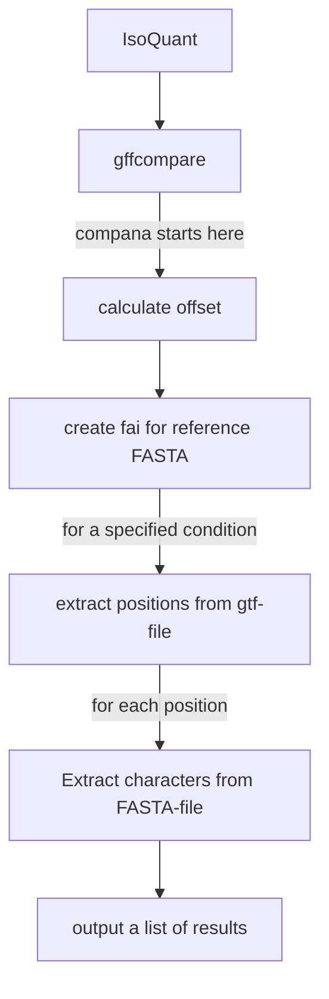
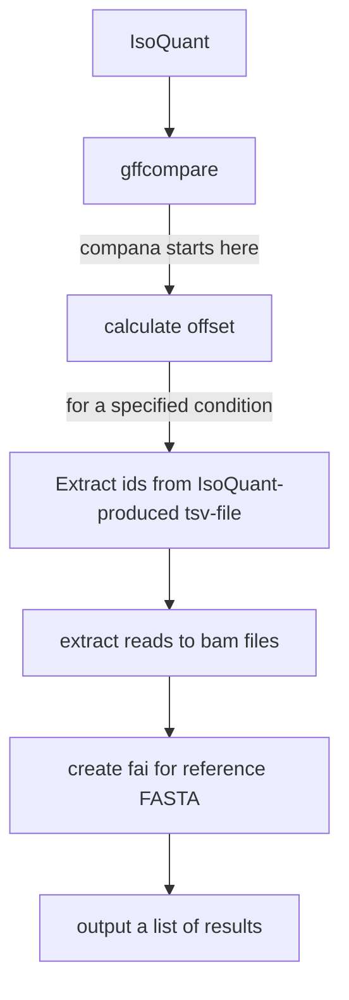

# Flowchat for pipeline

## Version 1

```mermaid
flowchart TD
    A[IsoQuant] --> B[gffcompare]
    B -->|compana starts here| C[calculate offset]
    C --> D[create fai for reference FASTA]
    D -->|for a specified condition| E[extract positions from gtf-file]
    E -->|for each position| F[Extract characters from FASTA-file]
    F --> G[output a list of results]
```

## Flowchart for pipeline - v2
The first attempt. I made errors in reasoning and went to the wrong direction. 

```mermaid
flowchart TD
    A[IsoQuant] --> B[gffcompare]
    B -->|compana starts here| C[calculate offset]
    C -->|for a specified condition| D[Extract ids from IsoQuant-produced tsv-file]
    D --> E[extract reads to bam files]
    E --> F[create fai for reference FASTA]
    F --> G[output a list of results]
```