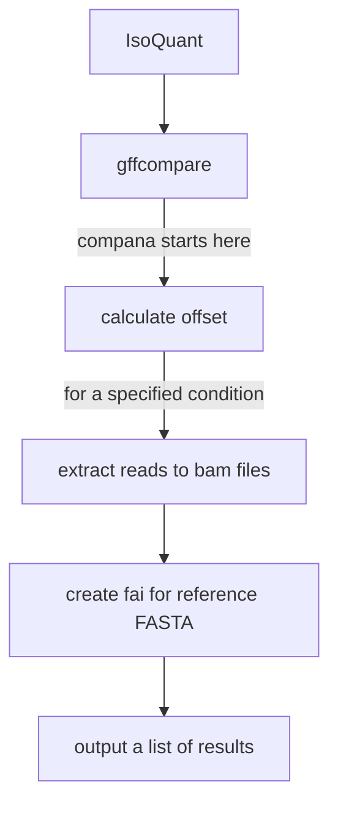

# Flowchart for pipeline

```mermaid
flowchart TD
    A[IsoQuant] --> B[gffcompare]
    B -->|compana starts here| C[calculate offset]
    C -->|for a specified condition| D[extract reads to bam files]
    D --> E[create fai for reference FASTA]
    E --> F[output a list of results]
```