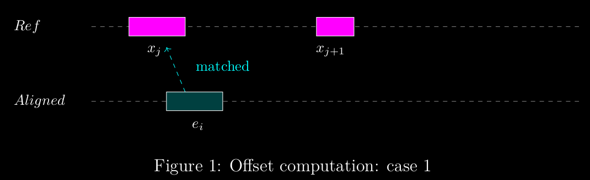
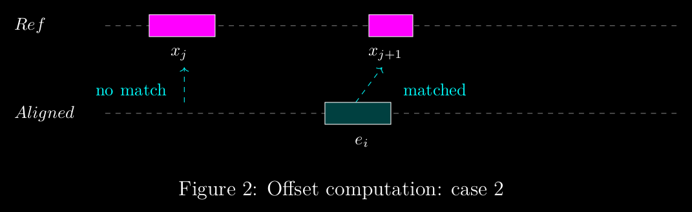
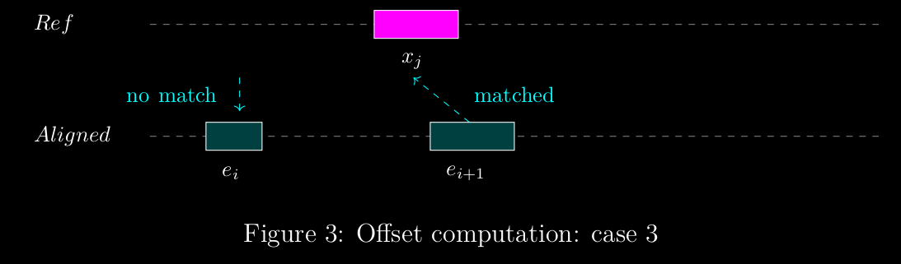
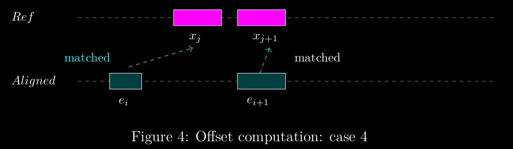

# General information

The purpose of this application is to study what happens in the locations, where the transcript provided by IsoQuant differs from the reference data.  

The application uses the following libraries to process information: [pysam](https://pysam.readthedocs.io/en/latest/), [gffutils](http://daler.github.io/gffutils/) and [pyfaidx](https://github.com/mdshw5/pyfaidx/)

The application expects the user to provide the following files:
1. A GTF-file produced by gffcompare. The gffcompare should be run with the GTF-file produced by IsoQuant and a reference GTF-file. 
2. The reference GTF-file
3. BAM-file containing the reads
4. (Optional and currently unnecessary) reference FASTA-file. 
5. A TSV-file produced by IsoQuant ending in 'model_reads.tsv'

User should provide additional arguments to define
- the gffcompare class-codes to select transcripts for processing
- the offset -case that will be looked into

With optional arguments user can adjust debugging, creating simple additional statistics or to force recreating the sqlite3-databases created by gffutils. For more information see [instruction manual](instruction-manual.md)

## Offsets

### Defining offset

`gffcompare` output contains class codes for transcripts. These class codes provide information on the quality of the alignment. One interesting aspect in the case of misalignments is the amount of the offset in the misalignment. Here we provide a definition for offset and detail how offset is calculated in this application. 

Let $S$ be  a transcript from an analyzed read and assume that $S$ has one or more exons as children. Let the set of these exons be $E = \\{e_1, \ldots , e_n\\},\\,n\in\mathbb{N},\\,\mid E\mid \ge 1$. Let $R$ be a reference transcript to which $S$ is being compared to. Let exons children in $R$ be $X = \\{x_1, \ldots, x_m\\}$. 

Each exon is given as a tuple with a start index and end index $(a, b)\\, a,b\in\mathbb{N},\\,a < b$. Let $e_i\in E$ and $x_j\in X$ be an arbitrary exons and let $e_i = (a_{e_i}, b_{e_j})$ and $x_j = (a_{x_i}, b_{x_j})$.  

We assume that for a selected transcript, the exon children do not overlap. That is, for arbitrary two exons $e_i = (a_{e_i}, b_{e_i}) $ and $e_k = (a_{e_k}, b_{e_k})$ ($e_i, e_k \in E$) it always holds that either $b_{e_i} < a_{e_k}$ or $b_{e_k} < a_{e_i}$

**Definition 1.** For arbitrary $e_i$ and $x_j$ The distance $a_{e_i} - a_{x_j}$ is the offset at the start index and the distance $b_{e_i} - b_{x_j}$ is the offset at the end index. Notice that if the offset is 'to the left', the output value is negative and similarily if the offset is 'to the right', the output value is positive.   

The total offset $t_{e_i,x_j}$ for $e_i$ and $x_j$ is the sum of the absolute value of these two offsets

$$ t_{e_i,x_j} =  \mid a_{e_i} - a_{x_j} \mid + \mid b_{e_i} - b_{x_j} \mid $$

**Definition 2.** For any $e_i$ we call the optimal match in $X$ to be the exon $x_j$ that satisfies the following conditions: 

1. The offset for $e_i$ compared to $x_j$ is the smallest possible. That is for $e_i$ and $X=[x_1, \ldots x_m]$ $\min \\{t_{e_i,x_1}, t_{e_i,x_2}, \ldots, t_{e_i,x_m} \\} = t_{e_i,x_j}$. 
2. There is no other exon $e_k\in E$ for which condition one applies with $x_j$ and $t_{e_k,x_j} < t_{e_i, x_j}$. 

### Computing offset

The basic idea in computing the offset is to have the lists of tuples $E$ and $X$ in ascending order. The list $E$ is then iterated over to find the optimal matches from list $X$ for the exons. At each index, if possible, the items in the next index are also considered for an optimal match.  

Let $e_i\in E$ and $x_j\in X$ be arbitrary elements and assume $j< \text{len}(X) - 1$ and $i< \text{len}(E) - 1$. Additionally assume that $e_i$ and $x_j$ are the first exons, for which offset is not yet computed. Four possible scenarios can happen when iterating the offset pairs in set $E$:  

1. for exons $e_1,\ldots, e_i$ and exons $x_1,\ldots x_{j}$ it holds that $e_i$ and $x_j$ are an optimal match
2. for exons $e_1,\ldots, e_i$ and exons $x_1,\ldots x_{j+1}$ exons $e_{i}$ and $x_{j+1}$ are an optimal match
3. for exons $e_1,\ldots, e_{i+1}$ and exons $x_1,\ldots, x_{j+1}$ exon $e_{i+1}$ and $x_{j}$ are an  optimal match
4. for exons $e_1,\ldots, e_{i+1}$ and exons $x_1,\ldots, x_{j+1}$ exons $e_{i+1}$ and $x_{j+1}$ are  an optimal match










Each of these cases needs to be considered. In case of $e_{i+1}$ being an element in the optimal match, $e_{i+2}$ needs to be considered on the next iteration as for it the match could be even more optimal.  

In cases 2 and 3 we notice that an exon from either the reference data or the aligned data is left without a pair. These instances will need to be noted in the data. In case 4 $e_i$ is paired with $x_j$ even though for $e_{i+1}$ $x_j$ the offset $t_{e_{i+1}, x_j}$ was smaller, as $x_{j+1}$ was a more suitable pair for $e_{i+1}$

### Pseudocode

The following pseudocode computes the offsets following the rules given in definition two:

```
function compute_offset(list E, list X)
  list_of_results = []
  x_start_index = 0
  for e_index in list E:
    result  = (inf, inf)
    for x_index in X from x_start_index to len(X):
      offset_between_aligned_and_reference_exon = compute total offset for E[e_index] and X[x_index] 
      if e_index < len(E) - 1:
        offset_between_reference_exon_and_next_aligned_exon = compute total offset for E[e_index + 1] and X[x_index]
        if total_offset_next < total_offset:
          if x_index < len(X) - 1:
            total_offset_next_ref = compute total offset for E[e_index + 1] and X[x_index + 1]
            if offset_between_aligned_and_reference_exon > offset_between_reference_exon_and_next_aligned_exon:
              result = (inf, inf)
              break inner loop
      if x_index < len(X) - 1:
        offset_between_aligned_exon_and_next_reference_exon = compute offset E[e_index] + X[x_index + 1]
        if offset_between_aligned_and_reference_exon > offset_between_aligned_exon_and_next_reference_exon:
          if e_index < len(E) - 1:
            offset_between_next_reference_exon_and_next_aligned_exon = calculate_total_offset(aligned_exons[e_index+1], reference_exons[r_index+1])
            if not offset_between_next_reference_exon_and_next_aligned_exon < offset_between_aligned_exon_and_next_reference_exon:
              append (-inf, -inf) to list_of_results
              x_start_index = x_index + 1
              continue
          else:
            append (-inf, -inf) to list_of_results
            x_start_index = x_index + 1
            continue
      result = (aligned_exons[e_index][0] - reference_exons[r_index][0], aligned_exons[e_index][1] - reference_exons[r_index][1])
      r_start_index = r_index + 1
      break
      offset_list.append(result)
    add result to list_of_results
  if x_start_index < len(X):
    for x_index from x_start_index to len(X):
      append (-inf, -inf) to list_of_results
  return list_of_results
```

Assume that we have a list of exons $E = [e_1, \ldots, e_n]$ and a list of reference exons $X=[x_1, \ldots , x_m]$. The algorithm starts from $e_1$ and iterates through the exons. Let us assume that the algorithm is now at an arbitrary index $i$ and processing exon $e_i$. The following steps happen:

1. set result to $(\inf, \inf)$
2. iterate through reference exons starting from the current x_start_index to the end of the reference exons. 
3. Let us remind ourselves that $t_{e_i, x_j}$ is the total total offset between $e_i$ and arbitrary $x_j$. If $t_{e_{i}, x_{j}} > t_{e_{i+1}, x_{j}}$, $e_i$ must be $(\inf, \inf)$. Append list and break the inner loop
4. if instead $t_{e_{i}, x_{j+1}}  < t_{e_{i}, x_{j}}$, then if $t_{e_{i+1}, x_{j+1}} > t_{e_{i}, x_{j+1}}$, then $x_{j}$ must be $(-\inf, -\inf)$. In that case append $(-\inf, -\inf)$ to the list and continue iterating through the inner loop. If the latter condition does not apply, append the offset $t_{e_{i}, x_{j}}$ to the list and break the inner loop. 
5. Finally once aligned exons are iterated through if there are reference exons left, append (-inf, -inf) for each remaining reference exon to the list of results
6. once all reference exons are iterated over or the inner loop breaks, append result to the list of results. 


### Offset output

1. In case of a match the offset is expressed from the point of view of the analyzed transcript in the form of a tuple of two integers $(a, b),\\,a,b\in\mathbb{Z}$. A negative integer indicates that the exon $e_i$ from the analyzed data has a smaller value than the matching reference exon $x_j$ and similarily a positive value indicates that the exon $e_i$ has a higher value
2. A tuple $(\inf, \inf)$ indicates that no optimal match for an exon in analyzed data was found (i.e. there's possibly an exon in the analyzed data that is not present in the reference data)
3. A tuple $(-\inf, -\inf)$ that no optimal match for an exon in the reference data was found (i.e. there's possibly an exon is missing from the analyzed data)


## Extracting information 
Once the offsets for each transcript are calculated, we can extract cases matching our interests. The offset results are iterated and for cases matching the pre-defined interesting case (wanted offset), results are extracted. 

```python
def extract_candidates_matching_selected_offset(offset_results: dict, wanted_offset, reference_db):
  extracted_candidates = {}
  for key and value in offset_results:
    if stand is negative:
      reverse value (list)
    for offset_pair in value:
      if abs(offset_pair[0]) == wanted_offset:
        fetch the correct exon from reference_db
        location of event = exon.start + value[i][0]
        store transcript_id, location, location type as 'start', strand
      if abs(value[i][1]) == self.offset:
        fetch the correct exon from reference_db
        location of event = exon.end + value[i][0]
        store transcript_id, location, location type as 'end', strand
  return extracted_candidates
```

The values are stored as a dictionary. The key is concatenated from the transcript\_id, exon number and location type (start/end) to ensure uniqueness. The dictionary contains the following values:

- transcript_id: id for IsoQuant transcript
- strand: +/-
- exon_number: number of exon in question (base-1)
- location: the location of the interesting event 
- location_type: start/end

The stored value is the location of the start or end of an exon in the IsoQuant transcript. The motivation behind this is that we want to look at what happens after the start or before the end of an exon in a pre-defined window. 

### Processing the imported BAM-file
The reads are fetched from a given BAM-file with pysam-libary. Reads are iterated through and for primary and secondary reads insertions and deletions are counted. See next sections for details on the functions called. 

```python
function process_bam_file(reads_and_locations: dict):
  for read in samfile.fetch():
    if read.is_supplementary:
        continue
    if read.query_name in reads_and_locations:
      for location, type in reads_and_locations[read.query_name]:
        make correction to location (by -1)
        validate: location in is in read, read has a cigar string, read has an end location        

        aligned_location = extract_location_from_cigar_string(
          read.cigartuples,
          read.reference_start,
          read.reference_end,
          idx_corrected_location)

        count_indels(
            read.cigartuples,
            aligned_location,
            location_type,
            strand)
```

### Processing a CIGAR-string
With [pysam](https://pysam.readthedocs.io/en/latest/) the cigar string for a read can be imported as a list of tuples using the `cigartuples` method. Additionally the location of the interesting event from offset computation and the POS-coordinate from the currently processed read are needed (POS = position, which is reference_start in the following pseudcode). 


The CIGAR-parsing begins by computing the relative position: `relative_position = location - reference_start`. This gives the distance to the location of the interesting event in the reference genome from the `start_location`, which is stored within the read. At the end we are interested in the position in the CIGAR-string matching this `relative_position`. To compute this we need to keep track of the reference position (`ref_position`) to know, when we reach the sought location. 

From the [SAM-tools documentation](https://samtools.github.io/hts-specs/SAMv1.pdf) we find the following table of information:

| Op | BAM | Description                   | Consumes query | Consumes reference |
|----|-----|-------------------------------|----------------|--------------------|
| M  | 0   | alignment match               | yes            | yes                |
| I  | 1   | insertion to the reference    | yes            | no                 |
| D  | 2   | deletion from the reference   | no             | yes                |
| N  | 3   | skipped region from reference | no             | yes                |
| S  | 4   | soft clipping                 | yes            | no                 |
| H  | 5   | hard clipping                 | no             | no                 |
| P  | 6   | padding                       | no             | no                 |
| =  | 7   | sequence match                | yes            | yes                |
| X  | 8   | sequence mismatch             | yes            | yes                |


All operation codes consume either query or reference, and the operation codes [0,2,3,7,8] consume reference. As we iterate through the tuples, each tuple cumulates the aligned_pairs_position. The operation codes [0,2,3,7,8] also cumulate the reference. We iterate as long as the ref_location is less than or equal to the relative_position. Once the ref_position exceeds the relative_position, we then calculate the exact aligned_pairs_position as follows. 


**Definition** Let $a$ be the position of `aligned_pairs_position`, $r_{\text{ref}}$ the ref\_position, $r_{\text{rela}}$ the relative\_position and $(x, n)$ be a `cigar_tuple` in which $x\in [0,2,3,7,8]$. That is $x$ is an op code that consumes reference and $n$ is the number of consecutive operations. Furthermore assume that 

$$r_{\text{ref}} < r_{\text{rela}} < r_{\text{ref}} + n.$$ 

The final aligned position is now 

$$a + n - (r_{\text{ref}} - r_{\text{rela}})$$


Some considerations: 

- reads are validated before calling the method, but some validation is still done. If the given CIGAR-string does not consume any reference, $-1$ is returned to indicate an error has occured
- if the `ref_position` is points to the location of the `reference_end`, return the result even if `ref_position` is less than or equal to relative\_position. 


And so we get the final pseudo code:

```python
function extract_location_from_cigar_string(self, cigar_tuples: list, reference_start: int, reference_end: int, location: int):
    relative_position = location - reference_start
    aligned_pairs_position = 0
    ref_position = 0

    for cigar_code_tuple in cigar_tuples:

        if cigar_code_tuple[0] in [0, 2, 3, 7, 8]:
            ref_position += cigar_code_tuple[1]
        if ref_position <= relative_position and not reference_start + ref_position == reference_end:
            aligned_pairs_position += cigar_code_tuple[1]
        else:
            return aligned_pairs_position + (cigar_code_tuple[1] - (ref_position - relative_position))

    return -1
```

## Extracting CIGAR-codes from the window next to aligned location

The method [cigartuples()](https://pysam.readthedocs.io/en/latest/api.html#pysam.AlignedSegment.cigartuples) from pysam-library returns a list of tuples with CIGAR-codes and number of operations for each code. \\

The following pseudo code demonstrates how the CIGAR-codes from the given window are extracted:

```python
function count_indels(cigar_tuples: list, aligned_location: int, loc_type: str):
    
  cigar_code_list = []    
  deletions = 0
  insertions = 0
  location = 0
    

  if loc_type == "end":
    aligned_location = aligned_location - window_size + 1

  for cigar_code in cigar_tuples:
    if window_size == len(cigar_code_list):
      break
    if location + cigar_code[1] > aligned_location:
      overlap = location + cigar_code[1] - (aligned_location + len(cigar_code_list))
      append min(window_size - len(cigar_code_list), overlap) times cigar_code[0] to cigar_code_list
      location += cigar_code[1]


  for cigar_code in cigar_code_list:
    if cigar_code == 2:
      deletions += 1
    if cigar_code == 1:
      insertions += 1

  store results 
```

As arguments the functions receives CIGAR-tuples, the location of the interesting event and the type of the location (start/end).  

First a few variables are initialized. The `cigar_code_list` will contain the CIGAR op-codes in the window we are interested in. Results will be in ascending order. Variables deletions and insertions simply count indels. Location keeps track of our current aligned location. If the location type is "end", we shift the window to the 'left' side of the aligned position, taking into account that we need to do an index correction of one.

We iterate the CIGAR-tuples until we find the first event in which the sum of the current location and next CIGAR operations exceeds the aligned location. After this, we input all or as many as possible op-codes to the `cigar_code_list`. If the size of the list is less than the window size, we continue interating. After the window is full, we calculate the number of indels from the CIGAR-codes and save the result.  

**Note:** At this time only deletions and insertions are counted, but the code can be easily adapted to collect information on all CIGAR-codes. 

## Data structures

After some benchmarking with python data structures `tuple`, `namedtuple` and `dict`, it appears that for this application and it's use casesthe differences in efficiency are not very significant, at least without some level of refactoring. For easier readibility and expandability dictionaries are for now used for data structures. 

**CASE: offset_results**
The offset results will be returned in a dictionary of dictionaries with the following structure:
```python
{
    'transcript_id': {
        'ref_id': '<str>',
        'strand': '<str>',
        'offsets': '<list of tuples>'
        'class_code': '<str>'
    }
}
```

**CASE: matching_cases_dictionary**
With the offsets computated we next extract the cases of interest. These are as well stored in a dictionary of dictionaries. The key consists of the transcript_id, exon number and location to guarantee the key to be unique:
```python
{
    'transcript_id.exon_<number>.loc_type': {
        'exon': '<int>',
        'location': '<int>',
        'location_type': '<str>',
        'strand': '<string>',
        'transcript_id': 'str'
    }
}
```

**CASE: reads_and_locations**
For computing the indels in given locations for each read, we finally need a list of reads and related information. Each read can be aligned to multiple transcripts. We again use a dictionary of dictionaries:
```python
{
    'read_id': {
        'location': '<int>',
        'location_type': '<str>',
        'strand': '<string>',
        'offset': 'int'
    }
}
```